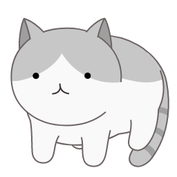

[//]: # (-----------------------------------------------------)
[//]: # (  )   

  
  <h1>
    <b>
        Hello, I'm <a href="https://hinmouc.github.io/">Hinmouc !</a>
    </b> 
    
  </h1>

    I am pursuing a MS degree in Computer Science and Technology. 
    My current research interests are in computer vision and image processing.

[//]: # (url for logo :https://icons8.com/icons/set/local)

    &nbsp;    
    &nbsp;    
    &nbsp;    
    &nbsp;    
    &nbsp;  

- __CURRENT RESEARCH__

    ---
    - Deep Learning
    - Low-Level Vision (Image Fusion and Enhancement)
    - Multi-modal

[//]: # (    ---)
[//]: # (    - One national invention patent &#40;granted&#41;)

[//]: # (https://yesicon.app/octicon?lang=zh-hans    #logo 图库)

##Blog

- :material-format-font:{ .lg .middle } __TOOLS__

    ---

    - [LaTex: Symbol and Use](research/latex.md)
    
- :octicons-bookmark-16:{ .lg .middle } __PAPERS__

    ---
    - [Evaluate for image fusion](research/Evaluate_IF.md)

[//]: # (  * good at badminton :badminton:)
## More about me
  * love jogging, fitness…
  * a little singing

